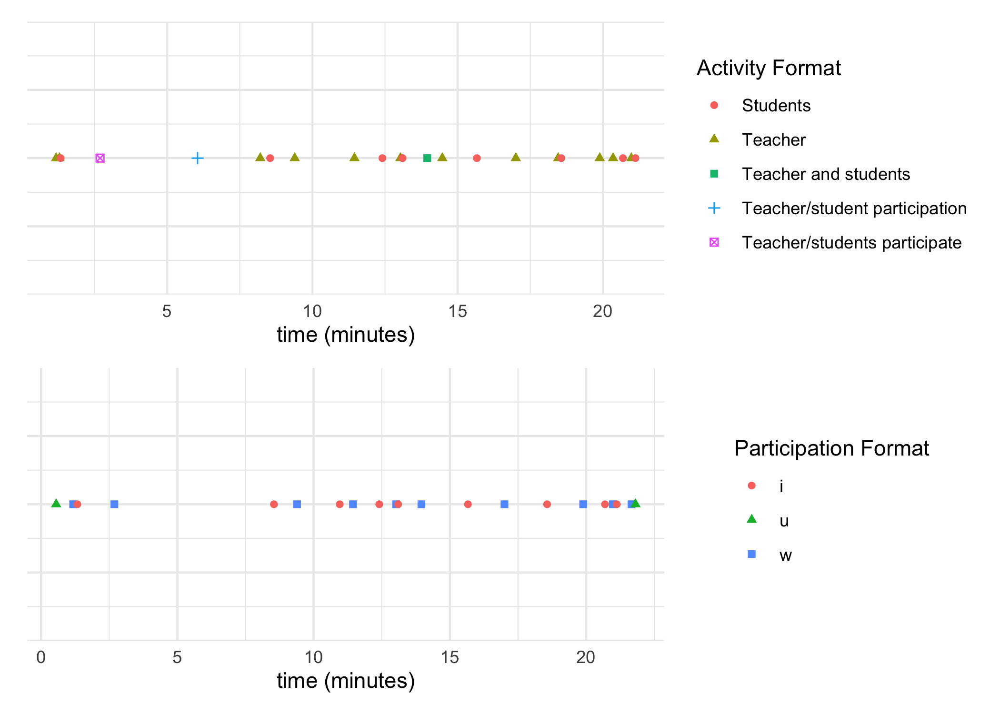

<!-- README.md is generated from README.Rmd. Please edit that file -->

```{r, include = FALSE}
knitr::opts_chunk$set(
  collapse = TRUE,
  comment = "#>",
  fig.path = "man/figures/README-",
  out.width = "100%"
)
```

# datavyu

<!-- badges: start -->
[](https://www.tidyverse.org/lifecycle/#experimental)
[](https://CRAN.R-project.org/package=datavyu)
<!-- badges: end -->

The goal of {datavyu} is to to  to facilitate the use of the open-source **datavyu** software for the analysis of qualitative audiovisual data

## Installation

You can install the development version from [GitHub](https://github.com/) with:

``` r
# install.packages("devtools")
devtools::install_github("jrosen48/datavyu")
```

The datavyu software must also be installed; see [here](https://datavyu.org/download.html)

## Use

*note*: The use of this package requires the use of the **datavyu** software's [Ruby API](https://datavyu.org/user-guide/api.html); note that while **datavyu** has a graphical user interface, it is accompanied by a number of Ruby scripts.

1. . Run the following Ruby script within the datavyu software by selecting Script and then Run Script; select a directory with one or more `.opf` files:

`csv2opf.rb`

<!-- I ran this on the Empirical Analyses folder to generate a bunch of data -->

2. Open the directory that the Ruby script created; a number of CSV files for each `.opf` file should now be created.

# Grab all of the files for one code:

```{r}
# find_unique_values("example-data/datavyu_output_07-06-2020_14-46", what = "codes")[1]

f <- datavyur::datavyu_col_search(folder = "example-data/datavyu_output_07-06-2020_14-46", cnames = "LogClass_AS_ActivityFormat") %>% as_tibble()

f$column %>% unique()
f$file %>% unique()

fc1 <- datavyur::import_column("LogClass_AS_ActivityFormat", folder = "example-data/datavyu_output_07-06-2020_14-46") %>% 
  as_tibble()

fc2 <- datavyur::import_column("LogClass_AS_ParticipationFormat", folder = "example-data/datavyu_output_07-06-2020_14-46") %>% 
  as_tibble()

fc1
fc2
```

# Not really sure this is useful, yet

```{r}

fc1_modified <- datavyur::temporal_align(all.cols = "LogClass_AS_ParticipationFormat", folder = "example-data/datavyu_output_07-06-2020_14-46") %>% as_tibble()

fc1_modified
```

3. These CSV files can be loaded like any others (and can be opened in Excel); within R, they can easily be used for visualizations, like the following, which was created with the [test.R](R/test.R) file. Ideally, this kind of plot would be created using an arbitrary number of files with a command such as:

`plot_ts()` (for 'plot time series')



## Other packages

We note that there is another R package that provides an interface to **datavyu;** that package is [{datavyur}](https://github.com/iamamutt/datavyu).

```{r, eval = FALSE}
library(datavyur)

datavyu_col_search(folder = "example-data/datavyu_output_07-06-2020_14-46", cnames = "column")

?datavyur::multi_merge()
```

At this time, we are using this package in an experimental sense, and recommend those looking for a more-developed package consider using {datavyur} instead of this package.
