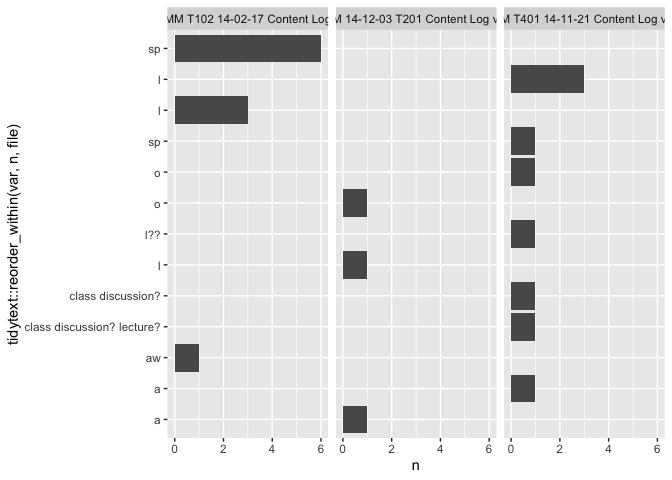

<!-- README.md is generated from README.Rmd. Please edit that file -->

# datavyu

<!-- badges: start -->

[](https://www.tidyverse.org/lifecycle/#experimental)
[](https://CRAN.R-project.org/package=datavyu)
[](https://travis-ci.com/tca2/datavyu)
<!-- badges: end -->

The goal of {datavyu} is to to to facilitate the use of the open-source
**datavyu** software for the analysis of qualitative audiovisual data.
This package extensively uses
[{datavyur}](https://github.com/iamamutt/datavyu) for preparing the data
for the summary statistic and plotting functions in this package. We do
not intend to duplicate the functionality of that excellent package in
ours; we focus instead on summarizing datavyu output and preparing the
output for use in other analyses.

## Installation

You can install the development version from
[GitHub](https://github.com/) with:

``` r
# install.packages("devtools")
devtools::install_github("tca2/datavyu")
```

The datavyu software must also be installed; see
[here](https://datavyu.org/download.html)

## Preparing files for analysis within datavyu

``` r
library(dplyr)
library(datavyur)
```

*note*: The use of this package requires the use of the **datavyu**
software’s [Ruby API](https://datavyu.org/user-guide/api.html); note
that while **datavyu** has a graphical user interface, it is accompanied
by a number of Ruby scripts.

#### 1\. Run the following Ruby script within the datavyu software by selecting Script and then Run Script; select a directory with one or more `.opf` files:

`csv2opf.rb`

<!-- I ran this on the Empirical Analyses folder to generate a bunch of data -->

#### 2\. Open the directory that the Ruby script created; a number of CSV files for each `.opf` file should now be created.

This is the directory (folder) passed to the datavyu functions below.

#### 3\. Using the {datavyur} package (see the ‘other package’ setion below), it is easy

to explore the unique *columns* and *files* in the output created.

``` r
# find_unique_values("ex-data/datavyu_output_07-06-2020_14-46", what = "codes")[1]

f <- datavyur::datavyu_col_search(folder = "ex-data/datavyu_output_07-06-2020_14-46") %>% as_tibble()

f$column %>% unique()
#> [1] "LogClass_AS_ActivityFormat"      "LogClass_AS_ParticipationFormat"
#> [3] "LogClass_IG"                     "LogClass_TO_MathPresent"        
#> [5] "LogClass_IS"                     "LogNotes"                       
#> [7] "LogClass_TaskUsed"
f$file %>% unique()
#> [1] "MM T102 14-02-17 Content Log"     "NM 14-12-03 T201 Content Log v.3"
#> [3] "NM T401 14-11-21 Content Log v.2"
```

## Summarizing a column

{datavyu} can help to summarize a column. It defaults to summarizing the
frequency of codes for a specified column.

``` r
summarize_column(column = "LogClass_AS_ActivityFormat",
                 directory = "ex-data/datavyu_output_07-06-2020_14-46")
#>   log_class_as_activity_format_code01 n    percent
#> 1                                   l 7 0.31818182
#> 2                                  sp 7 0.31818182
#> 3                                   a 2 0.09090909
#> 4                                   o 2 0.09090909
#> 5                                  aw 1 0.04545455
#> 6                   class discussion? 1 0.04545455
#> 7          class discussion? lecture? 1 0.04545455
#> 8                                 l?? 1 0.04545455
```

We can also explore the frequencies *by file* by changing the `by_file`
arguent to `TRUE`.

``` r
summarize_column(column = "LogClass_AS_ActivityFormat",
                 directory = "ex-data/datavyu_output_07-06-2020_14-46",
                 by_file = TRUE)
#>                                file log_class_as_activity_format_code01 n
#> 1      MM T102 14-02-17 Content Log                                  aw 1
#> 2      MM T102 14-02-17 Content Log                                   l 3
#> 3      MM T102 14-02-17 Content Log                                  sp 6
#> 4  NM 14-12-03 T201 Content Log v.3                                   a 1
#> 5  NM 14-12-03 T201 Content Log v.3                                   l 1
#> 6  NM 14-12-03 T201 Content Log v.3                                   o 1
#> 7  NM T401 14-11-21 Content Log v.2                                   a 1
#> 8  NM T401 14-11-21 Content Log v.2                   class discussion? 1
#> 9  NM T401 14-11-21 Content Log v.2          class discussion? lecture? 1
#> 10 NM T401 14-11-21 Content Log v.2                                   l 3
#> 11 NM T401 14-11-21 Content Log v.2                                 l?? 1
#> 12 NM T401 14-11-21 Content Log v.2                                   o 1
#> 13 NM T401 14-11-21 Content Log v.2                                  sp 1
#>      percent
#> 1  0.1000000
#> 2  0.3000000
#> 3  0.6000000
#> 4  0.3333333
#> 5  0.3333333
#> 6  0.3333333
#> 7  0.1111111
#> 8  0.1111111
#> 9  0.1111111
#> 10 0.3333333
#> 11 0.1111111
#> 12 0.1111111
#> 13 0.1111111
```

To summarize durations (instead of frequencies) by changing the `what`
argument, which defaults to `"frequency"`, but can be changed to
`"duration"`:

``` r
summarize_column(column = "LogClass_AS_ActivityFormat",
                 directory = "ex-data/datavyu_output_07-06-2020_14-46",
                 by_file = TRUE,
                 what = "duration")
#> # A tibble: 13 x 3
#>    LogClass_AS_ActivityFormat.code01 file                           sum_duration
#>  * <chr>                             <chr>                          <chr>       
#>  1 a                                 NM 14-12-03 T201 Content Log … 00:04:53:373
#>  2 a                                 NM T401 14-11-21 Content Log … 00:22:22:932
#>  3 aw                                MM T102 14-02-17 Content Log   00:10:08:256
#>  4 class discussion?                 NM T401 14-11-21 Content Log … 00:20:39:356
#>  5 class discussion? lecture?        NM T401 14-11-21 Content Log … 00:04:20:950
#>  6 l                                 MM T102 14-02-17 Content Log   00:46:17:990
#>  7 l                                 NM 14-12-03 T201 Content Log … 00:00:08:029
#>  8 l                                 NM T401 14-11-21 Content Log … 00:05:34:297
#>  9 l??                               NM T401 14-11-21 Content Log … 00:06:06:588
#> 10 o                                 NM 14-12-03 T201 Content Log … 00:00:25:134
#> 11 o                                 NM T401 14-11-21 Content Log … 00:12:35:959
#> 12 sp                                MM T102 14-02-17 Content Log   00:23:59:473
#> 13 sp                                NM T401 14-11-21 Content Log … 00:01:18:777
```

## Ploting the results of a summary of a column

{datavyu} can also help to plot the summary of a column. Here, we save
the output from `summarize_column()` to an object (we call this
`freq_summary`, but it can be named whatever we like).

Then, we use this output in the function `plot_column_summary()`:

``` r
freq_summary <- summarize_column(column = "LogClass_AS_ActivityFormat",
                                 directory = "ex-data/datavyu_output_07-06-2020_14-46")

plot_column_summary(freq_summary)
```


This also works by file—so long as the column is summarized by file:

``` r
freq_summary <- summarize_column(column = "LogClass_AS_ActivityFormat",
                                 directory = "ex-data/datavyu_output_07-06-2020_14-46",
                                 by_file = TRUE)

plot_column_summary(freq_summary)
```



Similarly, if the output is for the duration, rather than the frequency,
the durations are plotted:

``` r
duration_summary <- summarize_column(column = "LogClass_AS_ActivityFormat",
                                     directory = "ex-data/datavyu_output_07-06-2020_14-46",
                                     what = "duration")
```

Like for frequency, these can be ploted by file:

``` r
duration_summary_by_file <- summarize_column(column = "LogClass_AS_ActivityFormat",
                                             directory = "ex-data/datavyu_output_07-06-2020_14-46",
                                             what = "duration",
                                             by_file = TRUE)

plot_column_summary(duration_summary)
```


``` r
plot_column_summary(duration_summary_by_file)
```


## Using the pipe operator

Finally, output can be passed between functions with the pipe operator:

``` r
summarize_column(column = "LogClass_AS_ActivityFormat",
                 directory = "ex-data/datavyu_output_07-06-2020_14-46",
                 what = "duration") %>% 
  plot_column_summary()
```


## Features in-development

  - Improving `summarize_column()` and `plot_column_summary()` with
    further input and use

  - Plotting code co-occurrences with `plot_cooccurence()`

  - Summarizing an entire file (not just a single column in a file) with
    `summarize_file()`

  - Implementing generic functions (specifically: `plot()`,
    `summarize()`, `print()`)

  - Matching datavyu data to time series data in other, subsequent
    analyses using `datavyur::temporal_align()`

  - Addressing a number of
    [issues](https://github.com/tca2/datavyu/issues)

## Contributing

Please note that the datavyu project is released with a [Contributor
Code of
Conduct](https://contributor-covenant.org/version/2/0/CODE_OF_CONDUCT.html).
By contributing to this project, you agree to abide by its terms.

## pkgdown website

Because this repository is private, the
[{pkgdown}](https://pkgdown.r-lib.org/)-generated website for this
package is available only in the `/docs` directory. Drag the
`index.html` file in that directory into a browser to view this site.

## Acknowledgment

This material is based upon work supported by the National Science
Foundation under [Grant
No. 1920796](https://www.nsf.gov/awardsearch/showAward?AWD_ID=1920796&HistoricalAwards=false).
Any opinions, findings, conclusions, or recommendations expressed in
this material are those of the authors and do not reflect the views of
the National Science Foundation.
