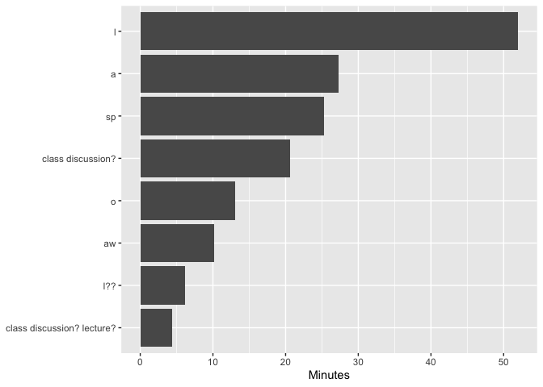
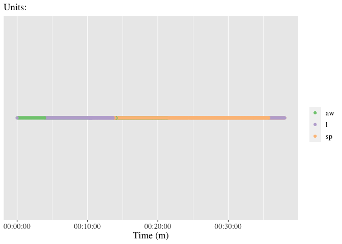

<!-- README.md is generated from README.Rmd. Please edit that file -->

# datavyu

<!-- badges: start -->

[](https://www.tidyverse.org/lifecycle/#experimental)
[](https://CRAN.R-project.org/package=datavyu)
[](https://travis-ci.com/tca2/datavyu)
<!-- badges: end -->

The goal of {datavyu} is to to to facilitate the use of the open-source
**datavyu** software for the analysis of qualitative audiovisual data.
This package extensively uses
[{datavyur}](https://github.com/iamamutt/datavyu) for preparing the data
for the summary statistic and plotting functions in this package. We do
not intend to duplicate the functionality of that excellent package in
ours; we focus instead on summarizing datavyu output and preparing the
output for use in other analyses.

## Installation

You can install the development version from
[GitHub](https://github.com/) with:

``` r
# install.packages("devtools")
devtools::install_github("tca2/datavyu")
```

The datavyu software must also be installed; see
[here](https://datavyu.org/download.html)

## Preparing files for analysis within datavyu

``` r
library(dplyr)
library(datavyur)
```

*note*: The use of this package requires the use of the **datavyu**
software’s [Ruby API](https://datavyu.org/user-guide/api.html); note
that while **datavyu** has a graphical user interface, it is accompanied
by a number of Ruby scripts.

#### 1\. Run the following Ruby script within the datavyu software by selecting Script and then Run Script; select a directory with one or more `.opf` files:

`csv2opf.rb`

<!-- I ran this on the Empirical Analyses folder to generate a bunch of data -->

#### 2\. Open the directory that the Ruby script created; a number of CSV files for each `.opf` file should now be created.

This is the directory (folder) passed to the datavyu functions below.

## Exploring the columns and files

Using {datavyu}, you can find the unique columns across all of the files
in a directory:

``` r
find_unique_columns("ex-data/datavyu_output_07-06-2020_14-46")
#> [1] "LogClass_AS_ActivityFormat"      "LogClass_AS_ParticipationFormat"
#> [3] "LogClass_IG"                     "LogClass_TO_MathPresent"        
#> [5] "LogClass_IS"                     "LogNotes"                       
#> [7] "LogClass_TaskUsed"
```

You can also find unique files

``` r
find_unique_files("ex-data/datavyu_output_07-06-2020_14-46")
#> [1] "MM T102 14-02-17 Content Log"     "NM 14-12-03 T201 Content Log v.3"
#> [3] "NM T401 14-11-21 Content Log v.2"
```

## Summarizing a column

{datavyu} can help to summarize a column. It defaults to summarizing the
frequency of codes for a specified column.

``` r
summarize_column(column = "LogClass_AS_ActivityFormat",
                 directory = "ex-data/datavyu_output_07-06-2020_14-46")
#> # A tibble: 8 x 3
#>   log_class_as_activity_format_code01     n percent
#> * <chr>                               <dbl>   <dbl>
#> 1 l                                       7  0.318 
#> 2 sp                                      7  0.318 
#> 3 a                                       2  0.0909
#> 4 o                                       2  0.0909
#> 5 aw                                      1  0.0455
#> 6 class discussion?                       1  0.0455
#> 7 class discussion? lecture?              1  0.0455
#> 8 l??                                     1  0.0455
```

Because `summary_column()` returns a tibble/data.frame, it can be
computed on:

``` r
summarize_column(column = "LogClass_AS_ActivityFormat",
                 directory = "ex-data/datavyu_output_07-06-2020_14-46") %>% 
  dplyr::filter(!stringr::str_detect(log_class_as_activity_format_code01, "[?]")) # note that names are cleaned upon being processed
#> # A tibble: 5 x 3
#>   log_class_as_activity_format_code01     n percent
#>   <chr>                               <dbl>   <dbl>
#> 1 l                                       7  0.318 
#> 2 sp                                      7  0.318 
#> 3 a                                       2  0.0909
#> 4 o                                       2  0.0909
#> 5 aw                                      1  0.0455
```

We can also explore the frequencies *by file* by changing the `by_file`
argument to `TRUE`.

We’ll be typing that folder file path a number of times; you can set an
option that will mean that the folder file path you set will be used *by
default*, though you can over-ride it any time you like.

``` r
options(directory = "ex-data/datavyu_output_07-06-2020_14-46")
```

``` r
summarize_column(column = "LogClass_AS_ActivityFormat",
                 by_file = TRUE)
#> # A tibble: 13 x 4
#>    file                           log_class_as_activity_format_co…     n percent
#>  * <chr>                          <chr>                            <dbl>   <dbl>
#>  1 MM T102 14-02-17 Content Log   aw                                   1   0.1  
#>  2 MM T102 14-02-17 Content Log   l                                    3   0.3  
#>  3 MM T102 14-02-17 Content Log   sp                                   6   0.6  
#>  4 NM 14-12-03 T201 Content Log … a                                    1   0.333
#>  5 NM 14-12-03 T201 Content Log … l                                    1   0.333
#>  6 NM 14-12-03 T201 Content Log … o                                    1   0.333
#>  7 NM T401 14-11-21 Content Log … a                                    1   0.111
#>  8 NM T401 14-11-21 Content Log … class discussion?                    1   0.111
#>  9 NM T401 14-11-21 Content Log … class discussion? lecture?           1   0.111
#> 10 NM T401 14-11-21 Content Log … l                                    3   0.333
#> 11 NM T401 14-11-21 Content Log … l??                                  1   0.111
#> 12 NM T401 14-11-21 Content Log … o                                    1   0.111
#> 13 NM T401 14-11-21 Content Log … sp                                   1   0.111
```

To summarize durations (instead of frequencies) by changing the
`summary` argument, which defaults to `"frequency"`, but can be changed
to `"duration"`:

``` r
summarize_column(column = "LogClass_AS_ActivityFormat",
                 summary = "duration")
#> # A tibble: 8 x 3
#>   log_class_as_activity_format_code01 duration     percent
#> * <chr>                               <chr>          <dbl>
#> 1 l                                   00:52:00:316  0.327 
#> 2 a                                   00:27:16:305  0.172 
#> 3 sp                                  00:25:18:250  0.159 
#> 4 class discussion?                   00:20:39:356  0.130 
#> 5 o                                   00:13:01:093  0.0820
#> 6 aw                                  00:10:08:256  0.0638
#> 7 l??                                 00:06:06:588  0.0385
#> 8 class discussion? lecture?          00:04:20:950  0.0274
```

Columns can also be summarized by file:

``` r
summarize_column(column = "LogClass_AS_ActivityFormat",
                 by_file = TRUE,
                 summary = "duration")
#> # A tibble: 13 x 4
#>    file                       log_class_as_activity_format_… duration    percent
#>  * <chr>                      <chr>                          <chr>         <dbl>
#>  1 MM T102 14-02-17 Content … l                              00:46:17:9…  0.576 
#>  2 MM T102 14-02-17 Content … sp                             00:23:59:4…  0.298 
#>  3 MM T102 14-02-17 Content … aw                             00:10:08:2…  0.126 
#>  4 NM 14-12-03 T201 Content … a                              00:04:53:3…  0.898 
#>  5 NM 14-12-03 T201 Content … o                              00:00:25:1…  0.0770
#>  6 NM 14-12-03 T201 Content … l                              00:00:08:0…  0.0246
#>  7 NM T401 14-11-21 Content … a                              00:22:22:9…  0.307 
#>  8 NM T401 14-11-21 Content … class discussion?              00:20:39:3…  0.283 
#>  9 NM T401 14-11-21 Content … o                              00:12:35:9…  0.173 
#> 10 NM T401 14-11-21 Content … l??                            00:06:06:5…  0.0837
#> 11 NM T401 14-11-21 Content … l                              00:05:34:2…  0.0763
#> 12 NM T401 14-11-21 Content … class discussion? lecture?     00:04:20:9…  0.0596
#> 13 NM T401 14-11-21 Content … sp                             00:01:18:7…  0.0180
```

## Ploting the results of a summary of a column

{datavyu} can also help to plot the summary of a column. Here, we save
the output from `summarize_column()` to an object (we call this
`freq_summary`, but it can be named whatever we like).

Then, we use this output in the function `plot_column_summary()`:

``` r
freq_summary <- summarize_column(column = "LogClass_AS_ActivityFormat")

plot_column_summary(freq_summary)
```


This also works by file—so long as the column is summarized by file:

``` r
freq_summary <- summarize_column(column = "LogClass_AS_ActivityFormat",
                                 by_file = TRUE, summary = "duration")

freq_summary <- dplyr::filter(freq_summary,
                              !stringr::str_detect(log_class_as_activity_format_code01, "[?]"))

plot_column_summary(freq_summary)
```



It is also possible to summarize across all of the data, or another
variable (in-development):

``` r
plot_column_summary(duration_summary, summarize_across = "all")
```

Will plot the means and standard errors of the means for each level of
each code.

Similarly, if the output is for the duration, rather than the frequency,
the durations are plotted:

``` r
duration_summary <- summarize_column(column = "LogClass_AS_ActivityFormat",
                                     summary = "duration")

plot_column_summary(duration_summary)
```


Like for frequency, these can be ploted by file:

``` r
duration_summary_by_file <- summarize_column(column = "LogClass_AS_ActivityFormat",
                                             summary = "duration",
                                             by_file = TRUE)

plot_column_summary(duration_summary_by_file)
```


## Using the pipe operator

Finally, output can be passed between functions with the pipe operator:

``` r
summarize_column(column = "LogClass_AS_ActivityFormat",
                 summary = "duration",
                 by_file = TRUE) %>% 
  plot_column_summary()
```


## Time series preparation and plot (in-development)

``` r
prepared_time_series <- prep_time_series(column = "LogClass_AS_ActivityFormat",
                                         specified_file = "MM T102 14-02-17 Content Log",
                                         directory = "ex-data/datavyu_output_07-06-2020_14-46")

prepared_time_series
#> # A tibble: 4,849 x 2
#>       ts code 
#>  * <dbl> <chr>
#>  1   235 aw   
#>  2   236 aw   
#>  3   237 aw   
#>  4   238 aw   
#>  5   239 aw   
#>  6   240 aw   
#>  7   241 aw   
#>  8   242 aw   
#>  9   243 aw   
#> 10   244 aw   
#> # … with 4,839 more rows
```

The `units` argument defaults to “s”, but can be changed to “m” (to
round the data to minutes) or “ms” (to not round the data and to retain
the units as milliseconds).

We can see how using milliseconds increases the number of data points:

``` r
prepared_time_series_ms <- prep_time_series(column = "LogClass_AS_ActivityFormat",
                                         specified_file = "MM T102 14-02-17 Content Log",
                                         directory = "ex-data/datavyu_output_07-06-2020_14-46",
                                         units = "ms")

prepared_time_series_ms
#> # A tibble: 4,825,743 x 2
#>        ts code 
#>  *  <int> <chr>
#>  1 235026 aw   
#>  2 235027 aw   
#>  3 235028 aw   
#>  4 235029 aw   
#>  5 235030 aw   
#>  6 235031 aw   
#>  7 235032 aw   
#>  8 235033 aw   
#>  9 235034 aw   
#> 10 235035 aw   
#> # … with 4,825,733 more rows
```

This time series data can then be plotted (using the data with the units
as seconds):

``` r
plot_time_series(prepared_time_series)
```



Like for other functions, if the data is calculated file, it will be
plotted by file (in-progress):

## Features in-development

  - Plotting code co-occurrences with `plot_cooccurence()`
  - Summarizing an entire file (not just a single column in a file) with
    `summarize_file()`
  - Addressing a number of
    [issues](https://github.com/tca2/datavyu/issues), including some
    that relate to the {datavyur} package

## Contributing

Please note that the datavyu project is released with a [Contributor
Code of
Conduct](https://contributor-covenant.org/version/2/0/CODE_OF_CONDUCT.html).
By contributing to this project, you agree to abide by its terms.

## pkgdown website

Because this repository is private, the
[{pkgdown}](https://pkgdown.r-lib.org/)-generated website for this
package is available only in the `/docs` directory. Drag the
`index.html` file in that directory into a browser to view this site.

## Acknowledgment

This material is based upon work supported by the National Science
Foundation under [Grant
No. 1920796](https://www.nsf.gov/awardsearch/showAward?AWD_ID=1920796&HistoricalAwards=false).
Any opinions, findings, conclusions, or recommendations expressed in
this material are those of the authors and do not reflect the views of
the National Science Foundation.
