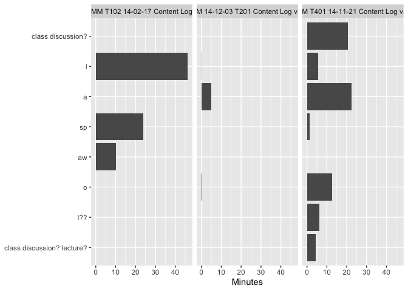

<!-- README.md is generated from README.Rmd. Please edit that file -->

# birdseyevyu

<!-- badges: start -->

[](https://www.tidyverse.org/lifecycle/#experimental)
[](https://CRAN.R-project.org/package=datavyu)
[](https://travis-ci.com/tca2/datavyu)
<!-- badges: end -->

The goal of {birdseyevyu} is to to to facilitate the use of the
open-source **datavyu** software for the analysis of qualitative
audiovisual data. This package extensively uses
[{datavyur}](https://github.com/iamamutt/datavyu) for preparing the data
for summary statistics and plotting functions in this package. We do not
intend to duplicate the functionality of that excellent package; instead
we focus on summarizing datavyu output and preparing the output for use
in other analyses.

## Installation

First, install the datavyu softwar; see
[here](https://datavyu.org/download.html)

You can install the development version of this package from
[GitHub](https://github.com/) with:

``` r
# install.packages("devtools")
devtools::install_github("tca2/birdseyevyu")
```

``` r
library(birdseyevyu)
```

## Preparing data for analysis

*note*: The use of this package requires the use of the **datavyu**
software’s [Ruby API](https://datavyu.org/user-guide/api.html); note
that while **datavyu** has a graphical user interface, it is accompanied
by a number of Ruby scripts.

#### 1. Run the following Ruby script (available in this repository) within the datavyu software by selecting Script and then Run Script; select a directory with one or more `.opf` files:

`datavyu2csv.rb`

<!-- I ran this on the Empirical Analyses folder to generate a bunch of data -->

#### 2. Open the directory that the Ruby script created; a number of CSV files for each `.opf` file should now be created.

This is the directory (folder) passed to the datavyu functions below.

## Exploring the columns and files

Using the *other* R package that works with datavyu, {datavyur} you can
find information on all of the files (and their columns and codes) in a
given directory (not run here:

``` r
library(datavyur)

datavyu_search("inst/extdata/datavyu_output_11-16-2020_13-26")
#> Warning: Using internal example data instead of user data!
#> Warning: no column to subset for inst/extdata/datavyu_output_11-16-2020_13-26
#>         column   codes  file
#> 1   childhands    hand dyad1
#> 2   childhands    hand dyad2
#> 3   childhands    hand dyad3
#> 4   childhands    look dyad1
#> 5   childhands    look dyad2
#> 6   childhands    look dyad3
#> 7   childhands  offset dyad1
#> 8   childhands  offset dyad2
#> 9   childhands  offset dyad3
#> 10  childhands   onset dyad1
#> 11  childhands   onset dyad2
#> 12  childhands   onset dyad3
#> 13  childhands ordinal dyad1
#> 14  childhands ordinal dyad2
#> 15  childhands ordinal dyad3
#> 16 parenthands    hand dyad1
#> 17 parenthands    hand dyad2
#> 18 parenthands    look dyad1
#> 19 parenthands    look dyad2
#> 20 parenthands    look dyad3
#> 21 parenthands  offset dyad1
#> 22 parenthands  offset dyad2
#> 23 parenthands  offset dyad3
#> 24 parenthands   onset dyad1
#> 25 parenthands   onset dyad2
#> 26 parenthands   onset dyad3
#> 27 parenthands ordinal dyad1
#> 28 parenthands ordinal dyad2
#> 29 parenthands ordinal dyad3
#>                                                                                                     local
#> 1   /Library/Frameworks/R.framework/Versions/4.0/Resources/library/datavyur/extdata/childhands__dyad1.csv
#> 2   /Library/Frameworks/R.framework/Versions/4.0/Resources/library/datavyur/extdata/childhands__dyad2.csv
#> 3   /Library/Frameworks/R.framework/Versions/4.0/Resources/library/datavyur/extdata/childhands__dyad3.csv
#> 4   /Library/Frameworks/R.framework/Versions/4.0/Resources/library/datavyur/extdata/childhands__dyad1.csv
#> 5   /Library/Frameworks/R.framework/Versions/4.0/Resources/library/datavyur/extdata/childhands__dyad2.csv
#> 6   /Library/Frameworks/R.framework/Versions/4.0/Resources/library/datavyur/extdata/childhands__dyad3.csv
#> 7   /Library/Frameworks/R.framework/Versions/4.0/Resources/library/datavyur/extdata/childhands__dyad1.csv
#> 8   /Library/Frameworks/R.framework/Versions/4.0/Resources/library/datavyur/extdata/childhands__dyad2.csv
#> 9   /Library/Frameworks/R.framework/Versions/4.0/Resources/library/datavyur/extdata/childhands__dyad3.csv
#> 10  /Library/Frameworks/R.framework/Versions/4.0/Resources/library/datavyur/extdata/childhands__dyad1.csv
#> 11  /Library/Frameworks/R.framework/Versions/4.0/Resources/library/datavyur/extdata/childhands__dyad2.csv
#> 12  /Library/Frameworks/R.framework/Versions/4.0/Resources/library/datavyur/extdata/childhands__dyad3.csv
#> 13  /Library/Frameworks/R.framework/Versions/4.0/Resources/library/datavyur/extdata/childhands__dyad1.csv
#> 14  /Library/Frameworks/R.framework/Versions/4.0/Resources/library/datavyur/extdata/childhands__dyad2.csv
#> 15  /Library/Frameworks/R.framework/Versions/4.0/Resources/library/datavyur/extdata/childhands__dyad3.csv
#> 16 /Library/Frameworks/R.framework/Versions/4.0/Resources/library/datavyur/extdata/parenthands__dyad1.csv
#> 17 /Library/Frameworks/R.framework/Versions/4.0/Resources/library/datavyur/extdata/parenthands__dyad2.csv
#> 18 /Library/Frameworks/R.framework/Versions/4.0/Resources/library/datavyur/extdata/parenthands__dyad1.csv
#> 19 /Library/Frameworks/R.framework/Versions/4.0/Resources/library/datavyur/extdata/parenthands__dyad2.csv
#> 20 /Library/Frameworks/R.framework/Versions/4.0/Resources/library/datavyur/extdata/parenthands__dyad3.csv
#> 21 /Library/Frameworks/R.framework/Versions/4.0/Resources/library/datavyur/extdata/parenthands__dyad1.csv
#> 22 /Library/Frameworks/R.framework/Versions/4.0/Resources/library/datavyur/extdata/parenthands__dyad2.csv
#> 23 /Library/Frameworks/R.framework/Versions/4.0/Resources/library/datavyur/extdata/parenthands__dyad3.csv
#> 24 /Library/Frameworks/R.framework/Versions/4.0/Resources/library/datavyur/extdata/parenthands__dyad1.csv
#> 25 /Library/Frameworks/R.framework/Versions/4.0/Resources/library/datavyur/extdata/parenthands__dyad2.csv
#> 26 /Library/Frameworks/R.framework/Versions/4.0/Resources/library/datavyur/extdata/parenthands__dyad3.csv
#> 27 /Library/Frameworks/R.framework/Versions/4.0/Resources/library/datavyur/extdata/parenthands__dyad1.csv
#> 28 /Library/Frameworks/R.framework/Versions/4.0/Resources/library/datavyur/extdata/parenthands__dyad2.csv
#> 29 /Library/Frameworks/R.framework/Versions/4.0/Resources/library/datavyur/extdata/parenthands__dyad3.csv
#>      classes            combined old_classes
#> 1  character     childhands.hand   character
#> 2  character     childhands.hand   character
#> 3  character     childhands.hand   character
#> 4    numeric     childhands.look     numeric
#> 5    numeric     childhands.look     numeric
#> 6    numeric     childhands.look     numeric
#> 7    numeric   childhands.offset     numeric
#> 8    numeric   childhands.offset     numeric
#> 9    numeric   childhands.offset     numeric
#> 10   numeric    childhands.onset     numeric
#> 11   numeric    childhands.onset     numeric
#> 12   numeric    childhands.onset     numeric
#> 13   numeric  childhands.ordinal     numeric
#> 14   numeric  childhands.ordinal     numeric
#> 15   numeric  childhands.ordinal     numeric
#> 16 character    parenthands.hand   character
#> 17 character    parenthands.hand   character
#> 18   numeric    parenthands.look     numeric
#> 19   numeric    parenthands.look     numeric
#> 20   numeric    parenthands.look     numeric
#> 21   numeric  parenthands.offset     numeric
#> 22   numeric  parenthands.offset     numeric
#> 23   numeric  parenthands.offset     numeric
#> 24   numeric   parenthands.onset     numeric
#> 25   numeric   parenthands.onset     numeric
#> 26   numeric   parenthands.onset     numeric
#> 27   numeric parenthands.ordinal     numeric
#> 28   numeric parenthands.ordinal     numeric
#> 29   numeric parenthands.ordinal     numeric
```

## Summarizing a column

{birdseyevyu} can help to summarize a column. It defaults to summarizing
the frequency of codes for a specified column.

Note that, by default, the code name combines the column and code names;
so, the `hand` code in the above summary would be combined with its
column `childhands` (or `parenthands`) to be specified as
`childhands.hand` or `parenthands_hand`:

``` r
summarize_column(column = "childhands",
                 code = "hand",
                 directory = "inst/extdata/datavyu_output_11-16-2020_13-26",
                 summary = "duration")
#> # A tibble: 5 x 3
#>   hand    duration     percent
#> * <chr>   <chr>          <dbl>
#> 1 "right" 00:22:20:078  0.311 
#> 2 "left"  00:21:24:616  0.298 
#> 3 ""      00:14:14:433  0.199 
#> 4 "both"  00:12:25:497  0.173 
#> 5 "l"     00:01:19:214  0.0184
```

------------------------------------------------------------------------

We can also explore the frequencies *by file* by changing the `by_file`
argument to `TRUE`.

We’ll be typing that folder file path a number of times. You can set an
option that let the folder file path you set be used *by default*,
though you can over-ride it any time you like.

``` r
options(directory = "inst/extdata/datavyu_output_11-16-2020_13-26")
```

Then, use this default by changing the the `by_file` argument to `TRUE`:

``` r
summarize_column(column = "childhands",
                 code = "hand",
                 by_file = TRUE)
#> # A tibble: 11 x 4
#>    file  hand        n percent
#>  * <chr> <chr>   <dbl>   <dbl>
#>  1 dyad1 ""          9   0.18 
#>  2 dyad1 "both"     15   0.3  
#>  3 dyad1 "left"     16   0.32 
#>  4 dyad1 "right"    10   0.2  
#>  5 dyad2 ""          8   0.242
#>  6 dyad2 "both"     10   0.303
#>  7 dyad2 "left"      5   0.152
#>  8 dyad2 "right"    10   0.303
#>  9 dyad3 "l"         1   0.333
#> 10 dyad3 "left"      1   0.333
#> 11 dyad3 "right"     1   0.333
```

------------------------------------------------------------------------

To summarize durations (instead of frequencies) change the `summary`
argument(defaults as `"frequency"`) to `"duration"`:

``` r
summarize_column(column = "childhands",
                 code = "hand",
                 summary = "duration")
#> # A tibble: 5 x 3
#>   hand    duration     percent
#> * <chr>   <chr>          <dbl>
#> 1 "right" 00:22:20:078  0.311 
#> 2 "left"  00:21:24:616  0.298 
#> 3 ""      00:14:14:433  0.199 
#> 4 "both"  00:12:25:497  0.173 
#> 5 "l"     00:01:19:214  0.0184
```

Columns of durations can also be summarized by file:

``` r
summarize_column(column = "childhands",
                 code = "hand",
                 by_file = TRUE,
                 summary = "duration")
#> # A tibble: 11 x 4
#>    file  hand    duration     percent
#>  * <chr> <chr>   <chr>          <dbl>
#>  1 dyad1 "left"  00:14:39:030  0.496 
#>  2 dyad1 "both"  00:05:44:939  0.195 
#>  3 dyad1 ""      00:04:36:021  0.156 
#>  4 dyad1 "right" 00:04:31:998  0.153 
#>  5 dyad2 "right" 00:10:10:331  0.355 
#>  6 dyad2 ""      00:09:38:412  0.336 
#>  7 dyad2 "both"  00:06:40:558  0.233 
#>  8 dyad2 "left"  00:02:11:428  0.0764
#>  9 dyad3 "right" 00:07:37:749  0.564 
#> 10 dyad3 "left"  00:04:34:158  0.338 
#> 11 dyad3 "l"     00:01:19:214  0.0977
```

## Ploting the results of a summary of a column

{birdseyevyu} can also help to plot the summary of a column. Here, we
save the output from `summarize_column()` to an object (we call this
`freq_summary`, but it can be named whatever we like).

Then, we use this output in the function `plot_column_summary()`:

``` r
freq_summary <- summarize_column(column = "childhands", code = "hand")

plot_column_summary(freq_summary)
```


This also works by file—so long as the column is summarized by file:

``` r
freq_summary <- summarize_column(column = "childhands", code = "hand",
                                 by_file = TRUE, summary = "duration")

plot_column_summary(freq_summary)
```


Similarly, if the output is for the duration, rather than the frequency,
the durations are plotted:

``` r
duration_summary <- summarize_column(column = "childhands", code = "hand",
                                     summary = "duration")

plot_column_summary(duration_summary)
```



Like for frequency, these can be ploted by file:

``` r
duration_summary_by_file <- summarize_column(column = "childhands", 
                                             code = "hand",
                                             summary = "duration",
                                             by_file = TRUE)

plot_column_summary(duration_summary_by_file)
```


## Using the pipe operator

Finally, output can be passed between functions with the pipe operator:

``` r
summarize_column(column = "childhands", 
                 code = "hand",
                 summary = "duration",
                 by_file = TRUE) %>% 
  plot_column_summary()
```


## Time series preparation and plot (in-development)

To visualize frequency of a certain coded datavyu column accounting for
the duration of the video, we can use the function `plot_time_series()`.
First we must prepare the data via saving the `prep_time_series()`
function as an object (here we use `prepared_time_series`).

Note that the available files can be found using
`datavyur::datavyu_col_search()`:

``` r
prepared_time_series <- prep_time_series(column = "childhands",
                                         code = "hand",
                                         specified_file = "dyad1")

prepared_time_series
#> # A tibble: 1,823 x 2
#>       ts code 
#>  * <dbl> <chr>
#>  1    29 left 
#>  2    30 left 
#>  3    31 left 
#>  4    32 left 
#>  5    33 left 
#>  6    34 left 
#>  7    35 left 
#>  8    36 left 
#>  9    37 left 
#> 10    38 left 
#> # … with 1,813 more rows
```

The `units` argument defaults to “s” (seconds), but can be changed to
“m” (rounds the data to minutes) or “ms” (retains datavyu’s default
units, milliseconds).

We can see how using milliseconds increases the number of data points:

``` r
prepared_time_series_ms <- prep_time_series(column = "childhands",
                                            code = "hand",
                                            specified_file = "dyad1",
                                            units = "ms")

prepared_time_series_ms
#> # A tibble: 1,772,038 x 2
#>       ts code 
#>  * <dbl> <chr>
#>  1 28846 left 
#>  2 28847 left 
#>  3 28848 left 
#>  4 28849 left 
#>  5 28850 left 
#>  6 28851 left 
#>  7 28852 left 
#>  8 28853 left 
#>  9 28854 left 
#> 10 28855 left 
#> # … with 1,772,028 more rows
```

Your `prepared_time_series_ms` object can now be plotted usinf the
`plot_time_series()` function. Here is an example of how time series
data can be represented, utilizing the functions defaulted unit value of
seconds:

``` r
plot_time_series(prepared_time_series)
```


## Features in-development

-   inter-rater agreement
-   creating a tidy data frame for ad hoc and custom analyses
-   Plotting code co-occurrences with `plot_cooccurence()`
-   Summarizing an entire file (not just a single column in a file) with
    `summarize_file()`
-   Addressing a number of
    [issues](https://github.com/tca2/datavyu/issues), including some
    that relate to the {datavyur} package

## Contributing

Please note that the datavyu project is released with a [Contributor
Code of
Conduct](https://contributor-covenant.org/version/2/0/CODE_OF_CONDUCT.html).
By contributing to this project, you agree to abide by its terms.

## Acknowledgment

This material is based upon work supported by the National Science
Foundation under [Grant
No. 1920796](https://www.nsf.gov/awardsearch/showAward?AWD_ID=1920796&HistoricalAwards=false).
Any opinions, findings, conclusions, or recommendations expressed in
this material are those of the authors and do not reflect the views of
the National Science Foundation.
