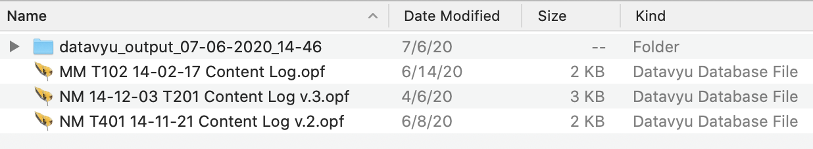
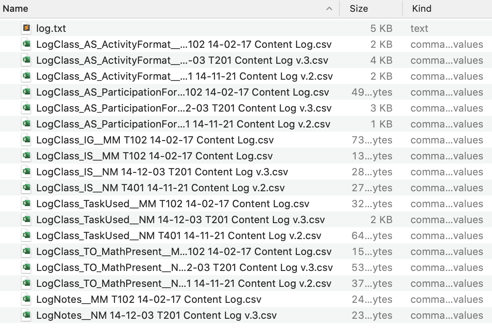
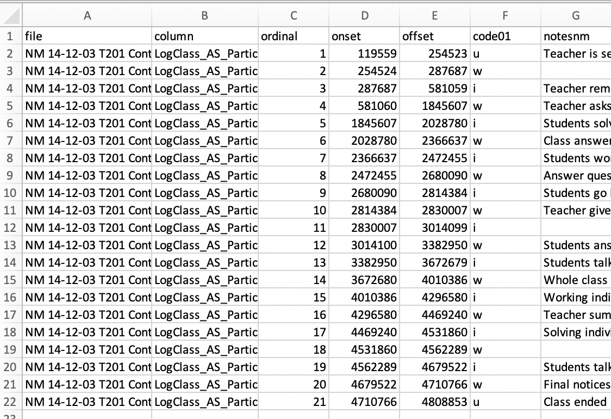

```{r setup, include=FALSE}
library(dplyr)
knitr::opts_chunk$set(echo = TRUE, message = FALSE, warning = FALSE, cache = TRUE,
                      fig.width = 7, fig.height = 4, fig.align = "center", dpi = 300,
                      collapse = TRUE)
```

# Outline

1. Background
1. Summarizing a column
1. Plotting a column summary
1. Preparing and plotting time series data
1. Next steps & discussion

---

class: center, middle

# 1. Background

---

# What we've been doing

- Learning about using datavyu
- Learning about an already-existing R package, [{datavyur}](https://github.com/iamamutt/datavyu)
- Developing a new R package focused on preparing datavyu output for subsequent analyses and summarizing and plotting the prepared data ([{datavyu}](https://github.com/tca2/datavyu))

---

# A look at datavyu (the qualitative audiovisual coding software)


---

class: center, middle

### A short (2 min.) video: https://datavyu.org/user-guide/guide.html

---

# A look at exported datavyu data



---



See more in this vignette on how to make this data: https://github.com/tca2/datavyu/blob/master/vignettes/preparing-data.Rmd

---

# How can it be easier to use datavyu output?



---

# Exploring the columns and files in the data

First, let's load the package.

```{r, install-eval-f, eval = FALSE}
devtools::install_github("tca2/datavyu") # only have to do once 
```

```{r, load}
library(datavyu)
```

---

Using {datavyu}, you can find the unique columns across all of the files in a directory.

```{r, find-unique-cols, eval = FALSE}
find_unique_columns("ex-data/datavyu_output_07-06-2020_14-46")
```

```{r, find-unique-cols-1, echo = FALSE}
find_unique_columns("ex-data/datavyu_output_07-06-2020_14-46") %>% 
  knitr::kable(col.names = "columns")
```

---

You can also find unique files

```{r, find-unique-files, eval = FALSE}
find_unique_files("ex-data/datavyu_output_07-06-2020_14-46")
```

```{r, find-unique-files-1, echo = FALSE}
find_unique_files("ex-data/datavyu_output_07-06-2020_14-46") %>% 
  knitr::kable(col.names = "files")
```

---

class: center, middle

# 2. Big task #1: Summarizing a column

---

# Summarizing a column

{datavyu} can help to summarize a column. It defaults to summarizing 
the frequency of codes for a specified column.

```{r, sum-cols}
summarize_column(column = "LogClass_AS_ActivityFormat",
                 directory = "ex-data/datavyu_output_07-06-2020_14-46")
```

---

# Setting an option

We'll be typing that folder file path a number of times. 

You can set an option that will mean that the folder file path you set will be used *by default*, though
you can over-ride it any time you like.

```{r, set-options}
options(directory = "ex-data/datavyu_output_07-06-2020_14-46")
```

---

We can also explore the frequencies *by file* by changing the `by_file` argument to 
`TRUE`.

```{r, sum-cal-by-file}
summarize_column(column = "LogClass_AS_ActivityFormat",
                 by_file = TRUE) %>% 
  dplyr::select(-file)
```

---

To summarize durations (instead of frequencies) by changing the `summary` argument,
which defaults to `"frequency"`, but can be changed to `"duration"`:

```{r, sum-col-duration}
summarize_column(column = "LogClass_AS_ActivityFormat",
                 summary = "duration")
```

---

Columns of durations can also be summarized by file:

```{r, sum-col-duration-by-file}
summarize_column(column = "LogClass_AS_ActivityFormat",
                 summary = "duration",
                 by_file = TRUE) %>% 
    dplyr::select(-file)
```

---

class: center, middle

# 3. Big task #2: Plotting a column summary

---

## Plotting the results of a summary of a column

{datavyu} can also help to plot the summary of a column:

```{r, plot-sum, fig.height=3.75}
freq_summary <- summarize_column(column = "LogClass_AS_ActivityFormat")

plot_column_summary(freq_summary)
```

---

This also works by file-so long as the column is summarized by file:

```{r, plot-sum-by-file}
freq_summary <- 
  summarize_column(column = "LogClass_AS_ActivityFormat",
                   summary = "duration",
                   by_file = TRUE)

plot_column_summary(freq_summary)
```

---

Similarly, if the output is for the duration, rather than the frequency, the durations are plotted:

```{r, plot-col-dur}
duration_summary <- 
  summarize_column(column = "LogClass_AS_ActivityFormat",
                   summary = "duration")

plot_column_summary(duration_summary)
```

---

Like for frequency, these can be plotted by file:

```{r, plot-col-dur-by-file}
duration_summary_by_file <- 
  summarize_column(column = "LogClass_AS_ActivityFormat",
                   summary = "duration",
                   by_file = TRUE)

plot_column_summary(duration_summary_by_file)
```

---

Output can be passed between functions with the pipe operator:

```{r, piping}
library(dplyr)

summarize_column(column = "LogClass_AS_ActivityFormat",
                 summary = "duration",
                 by_file = TRUE) %>% 
  plot_column_summary()
```

---

class: center, middle

# 4. Big task #3: Preparing and plotting time series data

---

# Time series preparation and plot

```{r, prep-ts}
prepared_time_series <- 
  prep_time_series(column = "LogClass_AS_ActivityFormat",
                   specified_file = "MM T102 14-02-17 Content Log")

prepared_time_series
```

---

The `units` argument defaults to "s", but can be changed to "m" (to round the data to minutes) 
or "ms" (to not round the data and to retain the units as milliseconds).

We can see how using milliseconds increases the number of data points:

```{r, prep-ts-ms}
prepared_time_series_ms <- 
  prep_time_series(column = "LogClass_AS_ActivityFormat",
                   specified_file = "MM T102 14-02-17 Content Log",
                   units = "ms") # takes around .8s to run

prepared_time_series_ms
```

---

This time series data can then be plotted (using the data with the units as seconds):

```{r, plot-ts}
plot_time_series(prepared_time_series)
```

---

class: center, middle

# 5. Next steps and discussion

---

# Next steps

- Improving time series preparation to work by file
- Improving time series plotting 
- Addressing many issues: https://github.com/tca2/datavyu/issues
- Currying along other variables (e.g., teacher ID)
- Reliability plots and statistics
- Improving plot theming
- Documenting and testing the package
- Preparing the package for CRAN submission
- Working with the creator of {datavyur} so that both packages can be on CRAN

---

class: middle, center

## We welcome your feedback and advice

https://github.com/tca2/datavyu


*This presentation was created with [{xaringan}](https://github.com/yihui/xaringan)*
